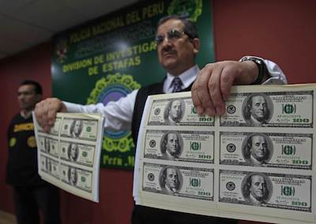

Generative Adversarial Networks (GAN) invented by [Ian Goodfellow 2014](https://arxiv.org/abs/1406.2661) are currently the most promising generative models. To understand the theory in detail you can either read the linked paper or read [this blog post by analyticsvidya](https://www.analyticsvidhya.com/blog/2017/06/introductory-generative-adversarial-networks-gans/). Here we just briefly cover the basics that are necessary to build a vanilla gan version in tensorflow that can generate nice looking images of numbers (MNIST dataset). 

### Info
The whole script code can be found [here](https://github.com/leox1v/GAN/blob/master/vanilla_gan/simple/gan_vanilla.py). There is also a slightly longer and more general version of the implementation, [here](https://github.com/leox1v/GAN/tree/master/vanilla_gan). 

## Basics
GANs are based on the idea of a two-player game. Player one tries to discriminate real data from fake data and player two tries to generate fake data to fool the first player. This game leads to an improvement of both players. Think about it like the generator being counterfeiters and the discriminator being the police. The better the police become in identifying counterfeit notes, the better the counterfeiters need to become to still produce fake money and vice versa. 

 

The advantage of this approach for training generative models is twofold  
1. The generator never sees any training samples. Instead of feeding the data directly to the generator we only give him the information whether his fake samples were correctly identified by the discriminator or not. Hence, the generator will not overfit and memorize training-samples.  
2. The generator doesn't have to learn the underlying data distribution of the data explicitely. We just need it implicitely so we can sample from it. This fact leads to a major improvement in performance.

## Implementation
Let's start by implementing a simple but powerful GAN for generating MNIST images. The architectures for the generator and the discriminator are shown in the next two images.  
  
Since we're using tensorflow we start off by defining our computational graph. First we define our two placeholders, X and Z. Where X is a batch of real MNIST images (flattened) and Z is a scalar sampled uniformly at random in the range from -1 to 1. And of course we need to have some imports in the beggining of the script.

```python
import numpy as np
import tensorflow as tf
from tensorflow.contrib.layers import xavier_initializer
from tensorflow.examples.tutorials.mnist import input_data
import matplotlib.gridspec as gridspec
import matplotlib.pyplot as plt
import os

hidden_dim = 128
img_dim = 28*28
batch = 64
z_dim = 100

def main():  
    ##
        # First we need to define the training operations
    ##
    # Specify the placeholders
    X = tf.placeholder(tf.float32, shape=[None, img_dim])
    Z = tf.placeholder(tf.float32, shape=[None, z_dim])
```

In the next step we need our generator and discriminator. To keep it simple both of them are neural networks with one hidden fully connected layer. One can think of more sophisticated networks including convolutions and more layer, but for this task the simple setup is enough. 

```python
def generator(z):
    with tf.variable_scope("generator"):
        g_hidden = tf.layers.dense(z, hidden_dim, activation=tf.nn.relu, kernel_initializer=xavier_initializer(), name="G1")
        g_logit = tf.layers.dense(g_hidden, img_dim, kernel_initializer=xavier_initializer(), name="G2")
        g_z = tf.nn.sigmoid(g_logit)
    theta_g = tf.get_collection(tf.GraphKeys.TRAINABLE_VARIABLES, scope="generator")
    return g_z, theta_g

def discriminator(x, reuse=False):
    with tf.variable_scope("discriminator"):
        d_hidden = tf.layers.dense(x, hidden_dim, activation=tf.nn.relu, kernel_initializer=xavier_initializer(), reuse=reuse, name="D1")
        d_logit = tf.layers.dense(d_hidden, 1, kernel_initializer=xavier_initializer(), reuse=reuse, name="D2")
    theta_d = tf.get_collection(tf.GraphKeys.TRAINABLE_VARIABLES, scope="discriminator")
    return d_logit, theta_d
```
As we can see we use a really simple setup with a ReLu activation function and 128 hidden units for both nets. The MNIST images are on grayscale with values between 0 and 1, so we use a sigmoid function to convert our generator output (```g_logit```) to this range. The two thetas we defined are the trainable variables for each net. We'll need it later to optimize the parameters individually.  
Now that we have specified our two networks we go on in the ```main()``` function to setup our graph.

```python
def main():  
    ##
        # First we need to define the training operations
    ##
    # Specify the placeholders
    X = tf.placeholder(tf.float32, shape=[None, img_dim])
    Z = tf.placeholder(tf.float32, shape=[None, z_dim])
    
    # Generate a fake image with the generator and the random noise vector z
    g_z, theta_g = generator(Z)

    # Use the discriminator to classify the real data X and then the fake data g_z
    d_real, theta_d = discriminator(X)
    d_fake, _ = discriminator(g_z, reuse=True)

```

What did we do? We used our generator network to generate a batch of fake data samples from the random noise values Z. Then we called the discriminator net to classify a real data set and afterwards also the generated fake data set. These two classifications from the discriminator (```d_real``` and ```d_fake```) are the important values we need to train our two networks. 

Let's quickly recap the goals of both networks to understand the upcoming optimization step. So the discriminator wants to be good in identifying real data, so he'd like to have ```d_real``` close to 1 and ```d_fake``` close to 0. The generator on the other hand wants to fool the discriminator with his fake data. Hence, he wants ```d_fake``` to be close to 1 and doesn't care about ```d_real```. Let's put the written goals in actual objectives.

 ```python 
## still in main(), under definition of d_fake, _ = ...
d_loss_real = tf.reduce_mean(
    tf.nn.sigmoid_cross_entropy_with_logits(logits=d_real, labels=tf.ones_like(d_real)))
    
d_loss_fake = tf.reduce_mean(
	tf.nn.sigmoid_cross_entropy_with_logits(logits=d_fake, labels=tf.zeros_like(d_fake)))
	
d_loss = d_loss_real + d_loss_fake  
 ```
 So we use the ```sigmoid_cross_entropy_with_logits ``` function to first apply a sigmoid to our ```d_real``` logit to get a probability and then with the cross entropy loss we compare it to our target which is an all ones vector. For the ```d_loss_fake```we do the same for the ```d_fake```logits and compare it to an all zeros vector. In the end we get the loss for our discriminator as the sum of those two losses.
 
 As mentioned before the goal of the generator is just to fool the discriminator, thus his loss is defined as 
 
```python
## still in main(), under d_loss = ...
g_loss = tf.reduce_mean(
tf.nn.sigmoid_cross_entropy_with_logits(logits=d_fake, labels=tf.ones_like(d_fake)))
```

Which is the same objective as the ```d_loss_fake``` before, just that the generator would like to push the value of ```d_fake```probabilities to zero. Hence, the all zeros vector as the labels.

Now we have defined our losses and we can proceed by optimizing those and initializing the session.

```python
## still in main(), under g_loss = ...

# Let's optimize the objectives
d_optimizer = tf.train.AdamOptimizer().minimize(d_loss, var_list=theta_d)
g_optimizer = tf.train.AdamOptimizer().minimize(g_loss, var_list=theta_g)

# and initialize a session
sess = tf.Session()
sess.run(tf.global_variables_initializer())
```

Now we only need to load our data (which is fairly simple thanks to the tensorflow trainings data examples) and then iteratively feed batches to our placeholders and optimize the two objectives.

```python
##
        # Now we can TRAIN our model
    ##
    # Loading the MNIST data set
    data = input_data.read_data_sets("MNIST_data/", one_hot=True)

    for i in range(int(30E3)):
        # We sample a batch from the MNIST train data set
        X_batch, labels = data.train.next_batch(batch)
        Z_batch = sample_z()
        _, _ = sess.run([d_optimizer, g_optimizer], feed_dict={X: X_batch, Z: Z_batch})

        if i % 1000 == 0:
            generated_imgs = sess.run(g_z, feed_dict={Z: sample_z(16)})
            plot(generated_imgs, i)
            
            
def sample_z(batch=batch, z_dim=z_dim):
	return np.random.uniform(-1., 1.,  size=[batch, z_dim])

```
Let's breakdown what's happening. For 30k iterations we always sample 64 images from the MNIST data set. We also sample a batch of 64 Z vectors, each a 100 dimensional vector with values uniformly spread between -1 and 1. We feed the batches of X (images) and Z in the defined graph and request the optimizing operations (```d_optimizer``` and ```g_optimizer```). After every 100th step we look at some resulting images from the generator by using our plotting function:

``` python
def plot(samples, i_ex):
    fig = plt.figure(figsize=(4, 4))
    gs = gridspec.GridSpec(3, 3)
    gs.update(wspace=0.05, hspace=0.05)
    
    for i, sample in enumerate(samples[:9]):
        ax = plt.subplot(gs[i])
        plt.axis('off')
        ax.set_xticklabels([])
        ax.set_yticklabels([])
        ax.set_aspect('equal')
        plt.imshow(sample.reshape(28, 28), cmap='Greys_r')

    if not os.path.exists('plots/'):
        os.makedirs('plots/')

    plt.savefig('plots/{}.png'.format(str(int(i_ex/1000)).zfill(3)), bbox_inches='tight')
    plt.close(fig)
```

And that's it. Now we train it for some iterations and hopefully generate images that look like numbers. 

## Results
  


The images show the results for some random input z after [0, 5k, 20k, 80k] iterations.

    


 
